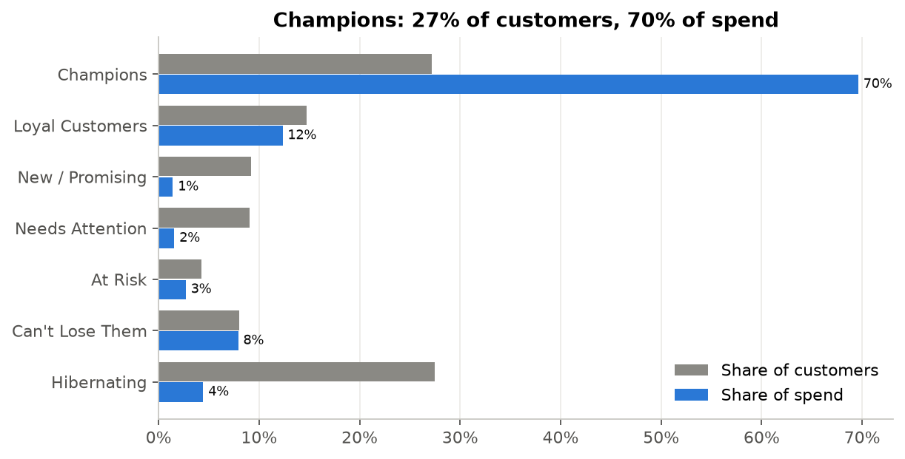
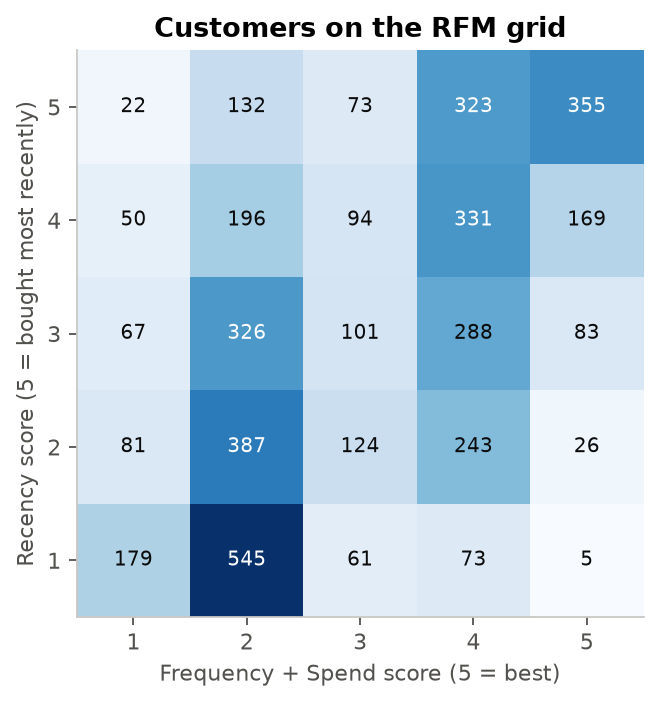
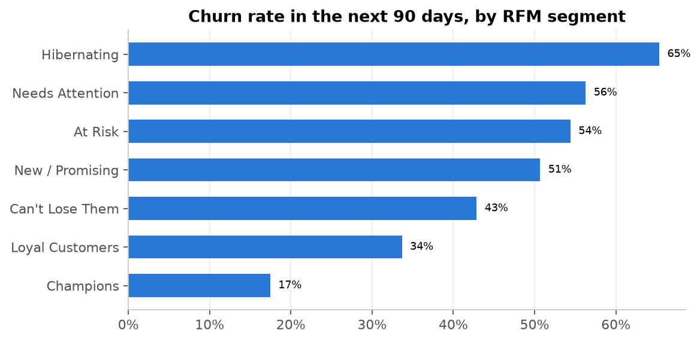
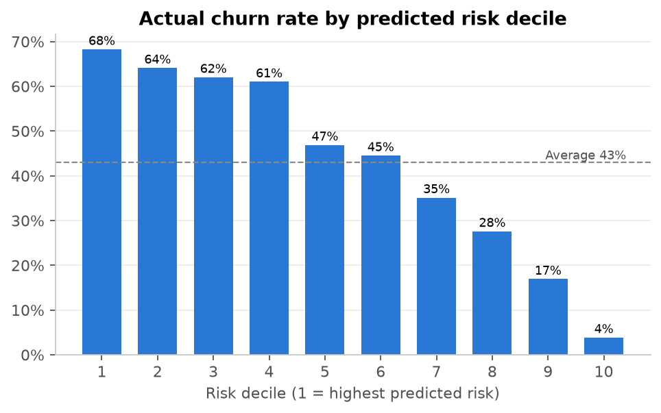
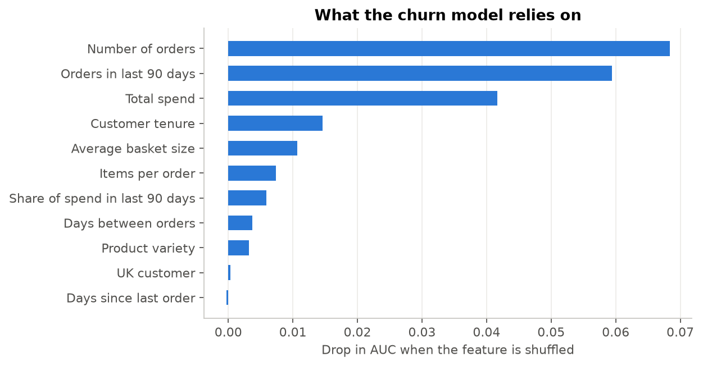
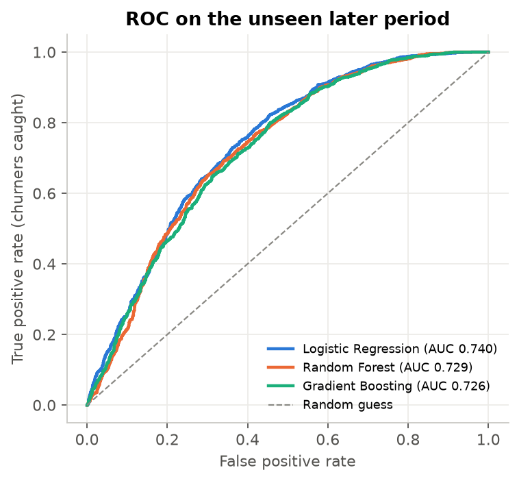
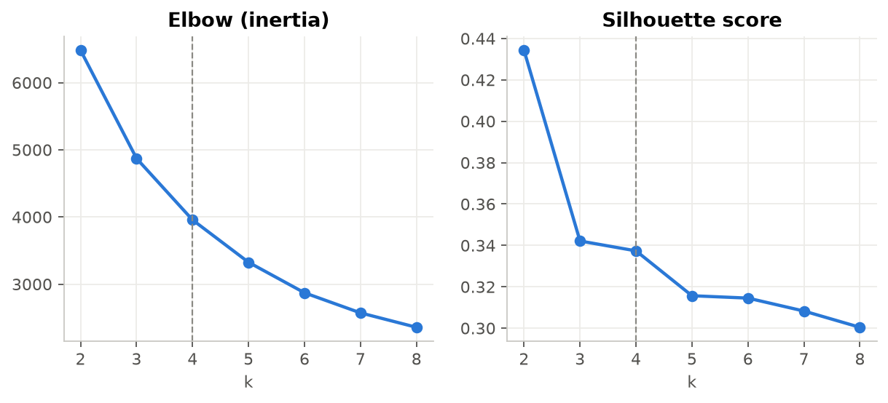

# Customer Segmentation & Churn Prediction

Customer segmentation and churn prediction for a UK online gift retailer, built to answer three CRM questions: **who are our customers, what should each group hear, and who is about to stop buying?**



## Results at a glance

| | |
|---|---|
| Data | 541,909 order lines → 391,283 after cleaning · 4,334 customers · 37 countries |
| Segments | 7 RFM marketing segments, cross-checked with K-Means (k = 4) |
| Biggest finding | **Champions are 27% of customers but 70% of spend**, and they have the lowest churn rate (17%) |
| Churn model | Logistic Regression, **out-of-time ROC-AUC 0.74** (5-fold CV 0.76) |
| Targeting | The 40% of customers the model rates riskiest churn at **63%** (average 43%) and include **59% of all churners**. The 30% it rates safest churn at only **16%** |
| Output | A segment playbook plus a ranked win-back list of **231 high-priority customers** |

## Approach

1. **Cleaning:** removed guest checkouts (no customer ID), cancellations, returns, postage and manual adjustments.
2. **RFM segmentation:** quintile scores for Recency, Frequency and Spend, mapped to 7 segments on the standard R × FM grid used by CRM teams (Champions, Loyal, New / Promising, Needs Attention, At Risk, Can't Lose Them, Hibernating).
3. **K-Means validation:** clustered log-scaled RFM and picked k = 4 using the elbow and silhouette charts. The segments line up closely with the clusters (for example, 99% of Hibernating customers fall in *Lost one-timers*).
4. **Churn prediction:** churn means *no purchase in the next 90 days*. Features are built only from orders before a cutoff date. The model is trained on one period (June to September 2011) and tested on a **later period it has never seen** (September to December 2011), so there is no leakage. Logistic Regression, Random Forest and Gradient Boosting were compared, and Logistic Regression won on both accuracy and explainability.
5. **Activation:** each segment gets a goal, a campaign idea and a channel, and every customer gets a churn risk score and a priority.

## Segment playbook

| Segment | Customers | 90-day churn | Goal | Campaign idea |
|---|---|---|---|---|
| Champions | 1,178 | 17% | Reward & advocate | Early access, referral programme, review requests |
| Loyal Customers | 639 | 34% | Upsell & deepen | Personalised bundles, cross-sell, tier upgrade |
| New / Promising | 400 | 51% | Onboard | Welcome series, second-order incentive |
| Needs Attention | 393 | 56% | Re-engage | Limited-time offer on past categories |
| At Risk | 185 | 54% | Win back | "We miss you" message, free shipping |
| Can't Lose Them | 347 | 43% | Urgent win back | Account-manager call, exclusive offer, survey |
| Hibernating | 1,192 | 65% | Low-cost reactivation | Seasonal sends only, suppress non-responders |

## Charts

| | |
|---|---|
|  |  |
|  |  |
|  |  |

**What drives churn:** the number of orders and orders in the last 90 days matter most. Customers who buy often and recently rarely lapse.

## Project structure

```
├── notebooks/segmentation_churn.ipynb   # full analysis with narrative (start here)
├── src/
│   ├── data.py           # download + cleaning
│   ├── segmentation.py   # RFM scoring, segments, K-Means
│   └── churn.py          # features, labels, models, lift table
├── outputs/
│   ├── charts/                 # 7 PNG charts
│   ├── customer_segments.csv   # every customer with RFM scores, segment, cluster
│   ├── segment_playbook.csv
│   ├── winback_list.csv        # ranked by priority and churn risk
│   └── results.json            # headline metrics
└── requirements.txt
```

## Run it

```bash
pip install -r requirements.txt
cd notebooks && jupyter notebook segmentation_churn.ipynb
```

The dataset (UCI Online Retail, Chen et al., 2012) downloads automatically on first run.

## Limitations & next steps

- The data covers one retailer over 12 months. Most customers are wholesale gift shops, so buying is seasonal and peaks around Christmas.
- There is no email, web or demographic data. Adding email engagement would likely improve the churn model.
- Next, A/B test the win-back offers against a hold-out group to measure the real uplift in retention.

## Tools

Python · pandas · scikit-learn · matplotlib · Jupyter
